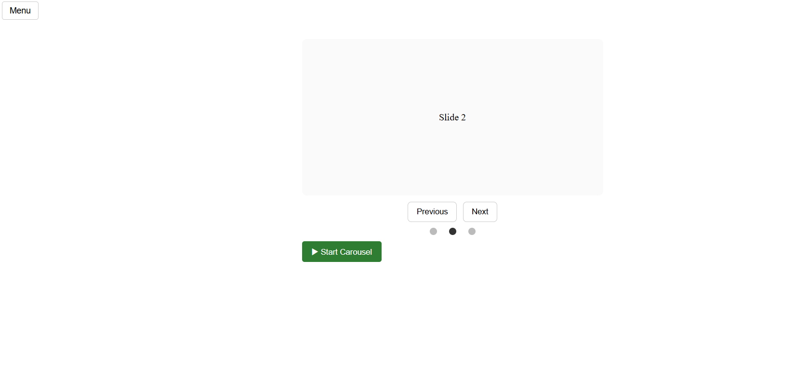

# JS UI Components

This project is a practice assignment based on The Odin Project's *Dynamic User Interface Interactions* lesson.

The goal is to build interactive UI components using **Vanilla JavaScript** — specifically:
- A **dropdown menu** that toggles visibility on click
- An **image carousel** with manual and automatic navigation

No external libraries or frameworks are used. This is a foundational exercise in **DOM manipulation**, **event handling**, and building accessible UI components with clean HTML, CSS, and JavaScript.

## Features

- **Dropdown Menu**
  - Click toggle with outside-click close
  - Accessible ARIA attributes
- **Image Carousel**
  - Previous/Next button navigation
  - **Bounded mode** (navigation stops at first/last slide, buttons disable appropriately)
  - Dot indicators with click and keyboard support
  - Start/Pause toggle for autoplay
  - Hover pause + resume
  - Keyboard arrow navigation

## Status

🛠️ Currently in development as a side project to reinforce frontend fundamentals while building toward backend specialization.

## Progress Log

- ✅ Dropdown toggle with outside click close
- ✅ Minimal dropdown styling applied
- ✅ Carousel navigation logic (Prev/Next + dots)
- ✅ Autoplay toggle with Start/Pause button
- ✅ Keyboard navigation and hover pause
- ✅ **Bounded mode** with dynamic button disabling
- 🔜 Final CSS polish and code cleanup

## Screenshot

## Run Locally
- Open `index.html` directly in your browser, **or**
- Use VS Code **Live Server** for auto-reload

 ## Live Demo
[View the project on GitHub Pages](https://cmac41691.github.io/js-ui-components/)

## Progress Update

**2025-08-10**  
- Implemented bounded mode for carousel navigation  
- Prev/Next buttons dynamically disable at the first/last slide  
- Preserved autoplay toggle, dot navigation, and accessibility features  
- All navigation types (buttons, dots, keyboard) now respect bounded limits  

**2025-08-15**  
- Added disabled state styling for Prev/Next buttons  
- Centered dot indicators with flexbox for improved alignment  
- Updated carousel controls layout with spacing + wrap support for mobile  
- Increased slide height and centered content to prevent layout shifts  
- Added subtle background and rounded corners for cleaner visual polish  
